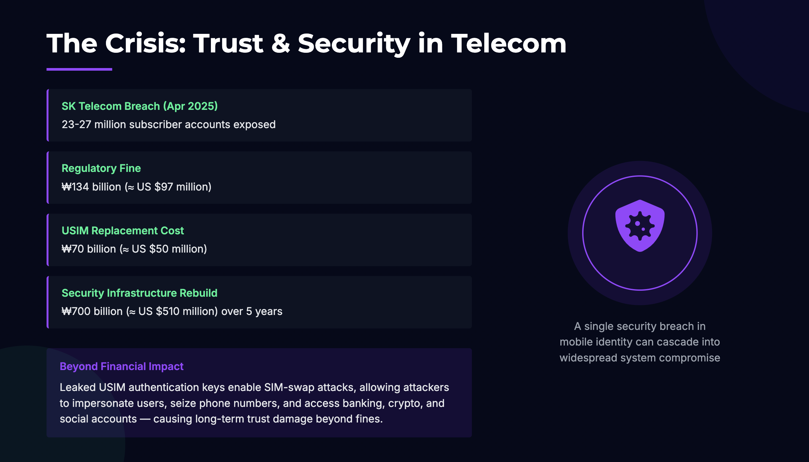
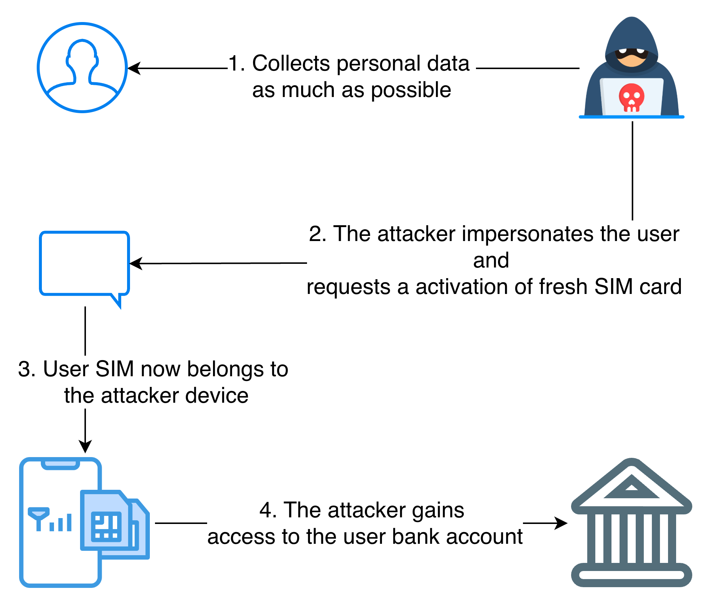
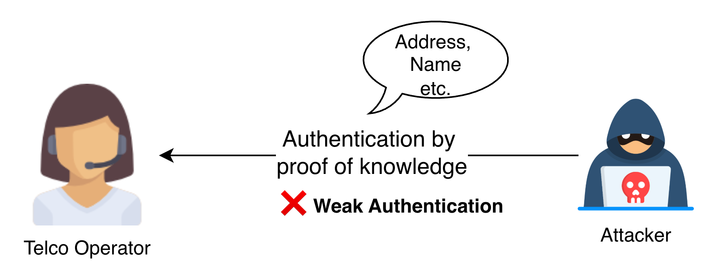

# 🧩 Pitch Deck Outline — *SIMProof: Decentralized SIM Ownership Verification on Solana*

## Importance of Trust and security for Telecos

In an era marked by rapid digital transformation while the trust is becoming elusive due to upcoming technologies such as generative AI, **trust and security** have become foundational to the infrastructure that underpins our lives. In the telecommunications sector, a domain that blends public-utility scale with critical national infrastructure responsibilities, they are more evidently important.

Consider the case of SK Telecom. In April 2025, the company disclosed a major breach of its USIM-related data, affecting approximately 23 – 27 million subscriber accounts. ([Korean TOPIK Resources][1]) The fallout was enormous: SK Telecom faced regulatory fines of ₩134 billion (≈ US $97 million), incurred roughly ₩70 billion (≈ US $50 million) in USIM replacement costs, and pledged an additional ₩700 billion (≈ US $510 million) over five years to rebuild its security infrastructure. ([Korean TOPIK Resources][2])

But what makes the incident truly alarming is that it doesn’t end with compensation or fines. The leaked USIM authentication keys and subscriber identifiers opened the door to a far more dangerous consequence — enabling SIM-swap attacks that let threat actors impersonate users, seize control of their phone numbers, and access banking, crypto, and social accounts.

This incident highlights how a single weakness in mobile identity management can cascade into enormous financial loss and long-term trust damage—not just for telcos, but for every digital service that relies on phone-based authentication.

## Simswap is one of the most imminent issues
Global data supports the urgency of this threat. According to a recent review of fraud trends by TransUnion, telecommunications companies are increasingly recognising identity and authentication risk as a top concern. ([transunion.com][3]) Even in the United Kingdom, the fraud prevention agency Cifas reported a staggering **1,055 % surge** in reported SIM-swap fraud between 2023 and 2024. ([cifas.org.uk][4])

## What is a SIM swap?
A SIM swap (also known as port-out scam, SIM-splitting, or SIM-jacking) is an account-takeover attack that exploits weaknesses in mobile phone authentication.
In a SIM swap, an attacker tricks a mobile carrier into transferring a victim’s phone number to a new SIM card that the attacker controls. Once this happens, all calls and text messages — including one-time passcodes (OTP) and 2FA codes — are routed to the attacker’s device instead of the victim’s phone.

This allows the attacker to reset passwords, bypass SMS-based two-factor authentication, and gain access to sensitive accounts such as online banking, cryptocurrency wallets, or social-media profiles.

## How does a SIM swap work?
A SIM Swap Works as follows:
1. **Data Gathering:**
   The attacker collects personal details about the victim through phishing, data breaches, or social-engineering (for example, using public social-media info).
2. **Impersonation:**
   The attacker contacts the victim’s mobile carrier, impersonating the real customer, and claims to have lost or damaged their SIM card.
3. **Carrier Porting:**
   The carrier — believing the request is legitimate — activates a **new SIM card** tied to the victim’s number. The victim’s real SIM card is deactivated, cutting off all mobile service.
4. **Account Takeover:**
   The attacker now receives all SMS messages and calls, including password-reset and 2FA codes, giving them full control over the victim’s digital accounts.

## Why is a SIM swap so crucial?
A SIM Swap is crucial as the attacker effectively **becomes the victim online** once the SIM is swapped.

They can:
* Reset login credentials on financial, crypto, and social accounts.
* Authorize fraudulent transactions.
* Use the phone number as proof of identity with other services.

Because mobile numbers are often used as a **primary identity factor**, a single successful SIM swap can lead to **financial loss, identity theft, and long-term damage to trust**.

## The root cause
The core reason SIM-swap attacks succeed isn’t merely technical — it’s social. Mobile carriers still rely on “proof-of-knowledge” authentication: personal details like your address, birthdate, or mother’s maiden name. These can all be obtained through phishing, data leaks, or social engineering, making this system inherently fragile.

To truly stop SIM-swap fraud, authentication must move beyond what we know to who we are and what we control. Biometric identity or cryptographic proof of wallet ownership offer a far stronger foundation for trust.

This is where our solution comes in. SIMProof introduces wallet-based authentication tied to non-transferable tokens issued by the Telco. Instead of answering questions on the phone, the real subscriber simply signs a digital challenge using their registered wallet — an action that only the legitimate user can perform. This shifts the trust model from human verification to cryptographic verification, eliminating social-engineering risk at its source.

## Our solution: SIMProof
The core problem behind SIM-swap attacks is weak, knowledge-based verification. Attackers impersonate customers over the phone or online, answering questions like a user’s address or birthday to trick telco staff into reissuing SIM cards. Once the number is ported, the attacker gains full control of SMS-based authentication and resets sensitive accounts.

**SIMProof** replaces this fragile process with cryptographic verification built on **Solana**.
The system ensures that only the legitimate subscriber—verified through a wallet they control—can authorize actions such as SIM reissue, number change, or plan updates.
1. **Contract & Registration**
   When a customer subscribes to a SIM or mobile plan, the Telco completes standard KYC and records the customer’s wallet address.
   If the user does not have one, the Telco app creates a **smart wallet** (AA-style) linked to their social or dアカウント login.
2. **Credential Issuance**
   The Telco mints a **non-transferable Token-2022 NFT** to that wallet.
   This token acts as the on-chain credential proving active subscription—containing only a random binding ID, with **no personal data**.
3. **Lifecycle Management**
   The Telco’s Solana program maintains a **Status PDA** for each credential.
   This PDA stores the token’s expiration (`expires_at`) and revocation flag (`revoked`), enabling the Telco to update validity instantly without touching the user’s wallet.
4. **Challenge Generation**
   Whenever verification is required (for example, SIM swap, eSIM activation, or contract modification), the Telco backend generates a **cryptographic challenge** containing a nonce, purpose, and expiry.
   The challenge is sent to the user through the web portal, mobile app, or a secure QR/push message.
5. **User Signature**
   The user reviews the request and **signs the challenge** with their wallet’s private key.
   This signature proves cryptographic control over the registered wallet.
6. **Verification**
   The Telco verifies the signature using the wallet’s public key, confirming that the signer truly controls the credential wallet.
7. **Authorization**
   Finally, the Telco checks on Solana that:
   * the wallet still **holds the Token-2022 NFT**, and
   * the corresponding **PDA status** is valid (`!revoked && now < expires_at`).
     If both conditions hold, the request is approved. Otherwise, it is rejected.

Through this flow, SIMProof turns human trust into **mathematical proof**.
The user owns their credential, the Telco manages its lifecycle, and Solana guarantees verifiable, tamper-proof authentication—eliminating the social-engineering vector that makes SIM-swap attacks possible

## Expected User Experience
After SIMProof is introduced, the **user experience becomes unified across all channels**—online, over the phone, or in-store. Regardless of how the request starts, the final step of verification is always cryptographic and one-tap simple:

🔹 **1. User receives a verification request**
The Telco backend generates a challenge (for example, SIM reissue or number change) and delivers it through the appropriate channel:

* **Online:** shown directly on the Telco web/app interface.
* **Over the phone:** sent as a push notification or secure link.
* **Offline (store):** displayed as a QR code on the staff terminal.

🔹 **2. User opens wallet or Telco app**
If the user has a standard crypto wallet (e.g., Phantom), the app opens automatically to show the request.
If the user uses a smart wallet (AA-style) created via **dアカウント**, they simply unlock their phone or use biometrics.
Both display:

> “DOCOMO requests verification for SIM reissue. Tap ‘Sign’ to confirm.”

🔹 **3. User signs the challenge**
The user taps **Sign** (or confirms via Face ID / fingerprint).
The wallet signs the challenge message with their private key—no passwords, no seed phrases, no manual steps.

🔹 **4. Verification is automatic**
The signed message returns to the Telco backend, which verifies the signature, checks **NFT ownership** and **PDA status** on **Solana**, and approves instantly.
The user interface confirms:

> ✅ “Verification complete. Your request has been approved.”

Through this flow, SIMProof makes verification **instant, consistent, and secure** across every customer-service channel. It turns fragile human trust into **cryptographic proof**, protecting users from SIM-swap fraud while preserving the smooth, familiar experience expected of modern telecom services.

## Conclusion and future potential
As the global mobile market of over **5.5 billion subscribers** faces rising fraud and identity risks, SIMProof positions Solana at the heart of a new trust infrastructure for telecommunications.
Beyond preventing SIM-swap attacks, its architecture lays the foundation for **decentralized mobile identity**.
In the near term, SIMProof leverages Solana’s fast, low-cost on-chain tokens to deliver verifiable ownership and contract lifecycle management.
Over time, as standards like **W3C Verifiable Credentials** and **Decentralized Identifiers** mature, these tokens can evolve into **interoperable credentials** connecting telcos, banks, and governments.
Furthermore, by incorporating **token-economy incentives**, SIMProof can reward users for secure behavior and enable telcos to bootstrap community-driven, decentralized network infrastructure—bridging the traditional telecom sector and the broader Web3 economy.

---

[1]: https://www.koreantopik.com/2025/04/sk-telecom-hit-by-cyberattack-23.html "SK Telecom Hit by Cyberattack: 23 Million Users’ Data Exposed in South ..."
[2]: https://www.koreantopik.com/2025/04/sk-telecom-hit-by-cyberattack-23.html "SK Telecom hit with $97 million fine over massive data leak"
[3]: https://www.transunion.com/lp/telco-fraud-report "Telco Fraud Report | TransUnion"
[4]: https://www.cifas.org.uk/newsroom/huge-surge-see-sim-swaps-hit-telco-and-mobile "1,055% surge in unauthorised SIM swaps as mobile and telecoms sector ..."
